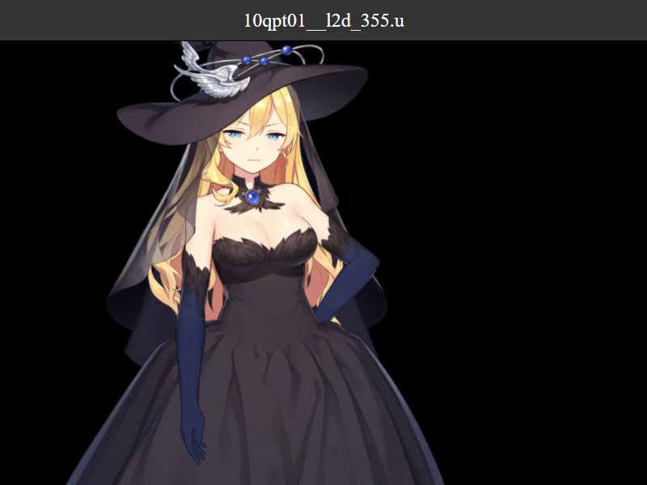

# Desktop AI VTuber

一个基于 **Electron** + **Live2D** + **LLM** + **GPT-SoVITS** 的桌面 AI 伴侣应用。在你的桌面上放置一个可爱的 Live2D 角色，她可以与你对话、拥有语音交互能力，并带有完整的 AI 大脑。



## 功能特性

- **Live2D 桌面角色** — 透明窗口显示 Live2D 模型，常驻桌面，支持拖拽移动
- **AI 对话** — 接入 LLM API，角色拥有个性设定和对话记忆
- **语音合成 (TTS)** — 基于 GPT-SoVITS，让角色用选定音色说话
- **语音识别 (ASR)** — 支持麦克风语音输入，自动转文字后对话
- **系统托盘** — 托盘图标快捷显示/隐藏，不影响工作
- **全局快捷键** — `Ctrl+Alt+V` 快速切换窗口可见性
- **嘴型同步** — Live2D 模型随 TTS 播放自动张嘴闭嘴

## 项目结构

```
desktop-vtuber/
├── main.js                    # Electron 主进程
├── preload.js                 # 预加载脚本（安全桥接）
├── config.json                # 用户配置文件（不提交到 Git）
├── config.example.json        # 配置模板
├── package.json               # 项目依赖
├── start-all.bat              # 一键启动（含 GPT-SoVITS）
├── start-app-only.bat         # 仅启动桌面应用
├── renderer/
│   ├── index.html             # 渲染进程页面
│   ├── renderer.js            # 渲染进程逻辑
│   └── style.css              # 样式
├── scripts/
│   ├── ensure-sovits.ps1      # GPT-SoVITS 启动保障脚本
│   └── local_asr.py           # 本地语音识别脚本
└── assets/
    ├── live2d/                # Live2D 模型文件
    │   └── ggc-10qpt01/       # 示例模型
    └── vendor/                # 第三方库（Live2D Cubism Core）
```

## 前置依赖

| 依赖 | 说明 |
|------|------|
| [Node.js](https://nodejs.org/) | >= 18.x，运行 Electron 应用 |
| [GPT-SoVITS](https://github.com/RVC-Boss/GPT-SoVITS) | 本地 TTS 语音合成服务 |
| Live2D 模型 | Cubism 4 或 3 格式的 `.model3.json` 模型 |

## 快速开始

### 1. 克隆项目

```bash
git clone https://github.com/Gunian7/Desktop-companion.git
cd Desktop-companion
```

### 2. 安装依赖

```bash
npm install
```

### 3. 配置

复制配置模板并修改：

```bash
cp config.example.json config.json
```

然后编辑 `config.json`：

#### LLM 配置

```json
{
  "llm": {
    "baseURL": "https://api.openai.com/v1",
    "apiKey": "sk-your-api-key",
    "model": "gpt-4o",
    "systemPrompt": "你的角色设定提示词",
    "maxHistoryTurns": 4
  }
}
```

支持任何兼容 OpenAI API 格式的服务（OpenAI、Anthropic、本地 ollama 等）。

#### TTS 配置（GPT-SoVITS）

```json
{
  "tts": {
    "baseURL": "http://127.0.0.1:9880",
    "refAudioPath": "你的参考音频路径.wav",
    "promptText": "参考音频对应的文本"
  }
}
```

#### Live2D 模型

将你的 Live2D 模型文件放入 `assets/live2d/` 目录，修改 `config.json` 中的 `live2d.modelPath` 指向模型 JSON 文件。

### 4. 启动

#### 方式一：完整启动（推荐）

双击 `start-all.bat`，自动完成：
1. 检查 GPT-SoVITS 环境
2. 安装 npm 依赖（如需要）
3. 启动 GPT-SoVITS API 服务
4. 等待 GPT-SoVITS 就绪后启动桌面应用

#### 方式二：仅启动桌面应用

```bash
npm start
```

或双击 `start-app-only.bat`（需手动先启动 GPT-SoVITS）。

> **注意：** GPT-SoVITS API 默认监听 `http://127.0.0.1:9880`，请确保在启动应用前该服务可用。

## 使用说明

### 基本操作

- **鼠标拖拽** — 拖动角色窗口移动位置
- **文本输入** — 底部输入框输入文字，点击"发送"或按 Enter 对话
- **语音输入** — 点击麦克风按钮，说话后自动识别并发送
- **系统托盘** — 右键点击托盘图标可隐藏/显示窗口或退出
- **全局快捷键** — `Ctrl+Alt+V` 切换窗口显示/隐藏

### 配置详解

| 配置项 | 说明 |
|--------|------|
| `llm.baseURL` | LLM API 地址 |
| `llm.apiKey` | API 密钥 |
| `llm.model` | 模型名称 |
| `llm.systemPrompt` | 角色 system prompt |
| `llm.maxHistoryTurns` | 对话记忆轮数 |
| `tts.baseURL` | GPT-SoVITS API 地址 |
| `tts.refAudioPath` | 参考音频路径（用于音色克隆）|
| `tts.promptText` | 参考音频的文本内容 |
| `live2d.modelPath` | Live2D 模型 JSON 路径 |
| `live2d.scale` | 模型缩放比例 |
| `live2d.x` / `live2d.y` | 模型位置偏移 |
| `window.clickThrough` | 是否启用鼠标穿透 |
| `window.bubbleAutoHideDelay` | 对话气泡自动消失延迟(ms) |

## 部署说明

本项目为本地桌面应用，无需服务端部署。如需在不同机器上运行：

1. **安装 GPT-SoVITS** — 在目标机器上部署 [GPT-SoVITS](https://github.com/RVC-Boss/GPT-SoVITS)，确保 API 服务可访问
2. **安装 Node.js** — 目标机器需要 Node.js >= 18.x
3. **复制项目** — 克隆或复制本项目到目标机器
4. **安装依赖** — 运行 `npm install`
5. **配置** — 修改 `config.json` 中的 API 密钥和服务地址
6. **启动** — 先启动 GPT-SoVITS，再运行 `npm start`

### 仅使用 LLM（无需 TTS）

如果你不需要语音功能，可以将 `tts.baseURL` 留空或指向无效地址，应用会仅以文字气泡形式回复。

### 更换 Live2D 模型

1. 将模型文件夹放入 `assets/live2d/` 目录
2. 修改 `config.json` 中 `live2d.modelPath` 为相对路径
3. 调整 `live2d.scale` 和位置偏移适配新模型

## 技术栈

- **[Electron](https://www.electronjs.org/)** — 跨平台桌面框架
- **[PixiJS](https://pixijs.com/) v7** — 2D 渲染引擎
- **[pixi-live2d-display](https://github.com/guansss/pixi-live2d-display)** — Live2D 渲染插件
- **[Cubism 4 Core](https://www.live2d.com/sdk/about/cubism-core/)** — Live2D 运行时
- **[GPT-SoVITS](https://github.com/RVC-Boss/GPT-SoVITS)** — 语音合成
- **OpenAI-compatible API** — LLM 接口

## 许可证

本项目仅供个人学习和娱乐使用。
